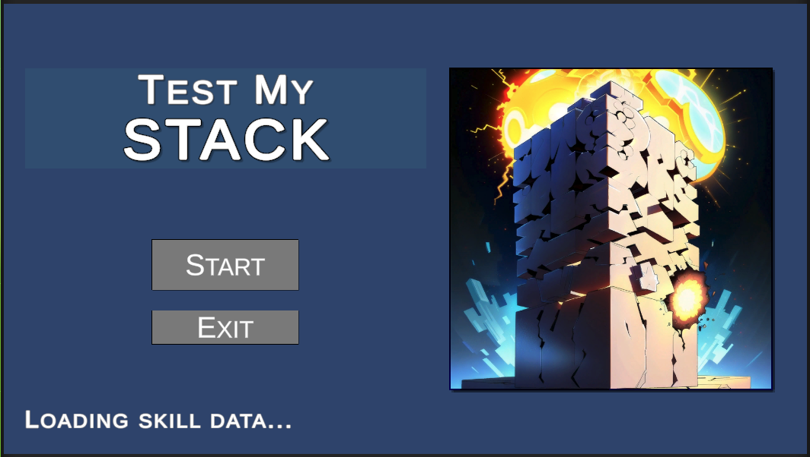
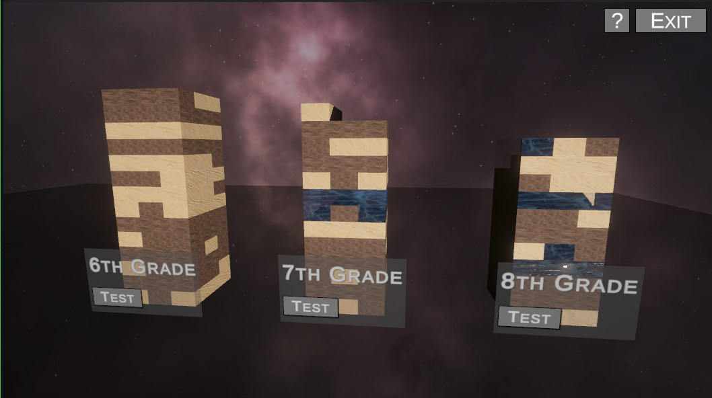

# "Test My Stack" - Jenga 3D experience

This exercise is a 3D Simulation of a Jenga where the blocks reference a Student topic learning.

Each Jenga stacks comprises the knowledge topics for a give Grade, and each block is assigned a material based on their "mastery" of the topic.

- **Glass**, which symbolizes a concept the student does not know and needs to learn;
- **Wood**, which symbolizes a concept that the student has learned but was not tested on;
- **Stone**, which symbolizes a concept that the student was tested on and mastery was confirmed;

The Jenga Stacks are build using data fetch via http.

For the "Test My Stack" Gameplay, the Glass blocks are eliminated, causing the stack to topple over if they have many gaps.

---

## Brief

This Game has been made with Unity 2022.2.16f1. It consist of two scenes:

- The **LoadingScene** handles fetching the data from the external source. The Start button is only enabled after the data has loaded, in case of error a window with the error message is desplayed and you are forced to Exit the application.

- The **GameScene** contains the simulation, as *required* only 3 stacks are show (the first three retrieved when parsing the data). Once the stacks are built, the Player can focus between stacks using the arrow keys (left / rigth) and orbit around the focused Stack dragging the mouse while holding the right mouse button.

